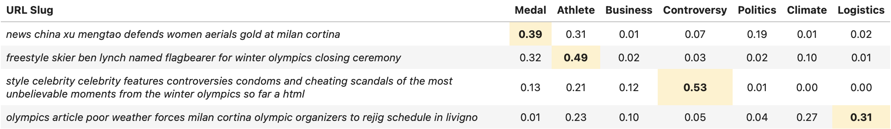
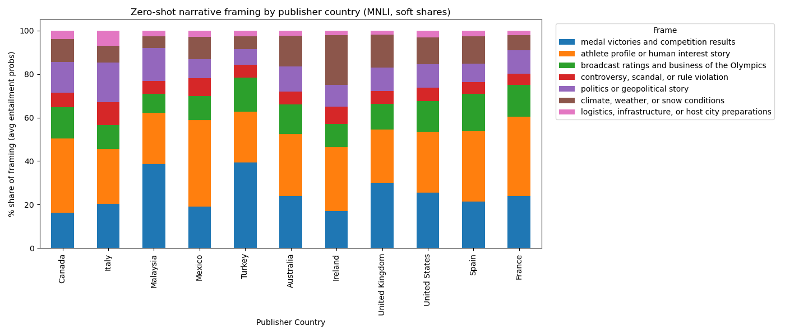
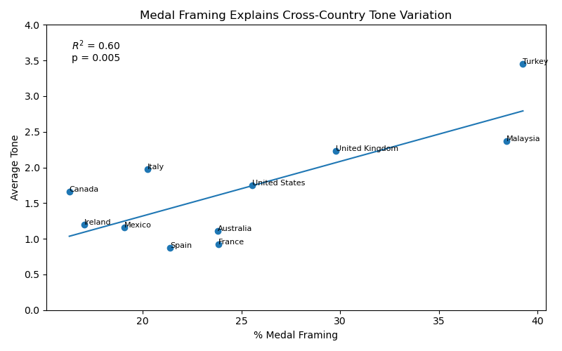
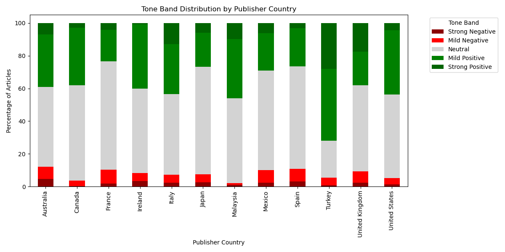
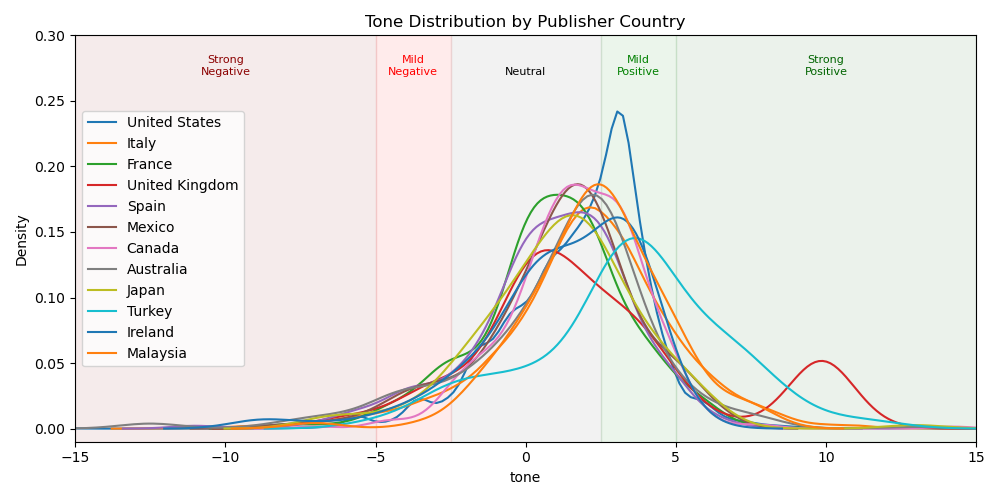

# Medals, Not Scandals: How Countries Framed the 2026 Winter Olympics

**By Michael Strommer**  
*Sports Analytics Group Berkeley (SAGB)*  
*Data-driven insights into global media narratives at Milano Cortina 2026*

---

## One Event, Many Stories

When the world watches the Olympics, it feels like a shared experience. The same races, the same podiums, the same moments of triumph and heartbreak.
But the stories people read about those moments are far from uniform.

From Milan to Tokyo, from New York to Istanbul, media outlets across the world covered the same Winter Games—yet told strikingly different stories. Some emphasized medal counts and national victories. Others focused on athletes’ personal journeys, political tensions, or logistical challenges surrounding the event.
That raises a deeper question: **Are countries simply reporting the Olympics—or are they framing them in fundamentally different ways?**

To answer this, we analyzed tens of thousands of global news articles from the **Milano Cortina 2026 Winter Olympics (February 6–22)**, using natural language processing (NLP) to classify narratives and measure sentiment across countries.
What emerged was a surprisingly clear pattern: **The more a country focused on medals, the more positive its Olympic coverage became.**

## Turning Global News into Structured Narratives

To compare how countries covered the Games, we built a multilingual analysis pipeline using global news data from GDELT through Google BigQuery. We collected articles published throughout February 2026—capturing the lead-up, the Games themselves, and the immediate aftermath.
Each article was processed and assigned to one of several narrative categories—ranging from medal results and athlete profiles to controversy, politics, and infrastructure. At the same time, we measured the tone of each article using GDELT’s sentiment scoring system.

Rather than relying on subjective interpretation, this allowed us to quantify two key dimensions of media coverage:
- **What stories were being told** (narrative framing)  
- **How those stories were told** (emotional tone)

By aggregating these measures at the country level, we could compare national media ecosystems on equal footing.
To make the classification interpretable, we used a multilingual **DeBERTa model in a zero-shot setting**. Instead of training a custom classifier, we asked the model to evaluate how likely each article belonged to predefined narrative categories.

---

### Example: How the Model Interprets Articles

Below are examples of URL-based article summaries and how the model assigns probabilities across different narrative frames.

This approach allows us to translate raw news coverage into structured, comparable narratives—capturing nuance instead of forcing each article into a single category.

---

## A Patchwork of Olympic Narratives

The results show that while the Olympics may be global, the way they are covered is deeply local.
Some countries leaned heavily into competition-driven storytelling. In Turkey and Malaysia, for example, nearly **40% of coverage centered on medal victories and results**. In these cases, the Olympics were framed primarily as a contest—who won, who lost, and how nations performed.

Other countries took a different approach. Canada and Mexico devoted a much larger share of coverage to athlete-focused stories, highlighting personal journeys, struggles, and human interest angles rather than outcomes alone.
Meanwhile, countries like Italy—the host nation—showed a more balanced narrative mix, incorporating not only competition but also political, logistical, and institutional perspectives on the Games.

> *(Stacked bar chart showing distribution of narrative categories across countries)*

---

## The Medal Effect

These differences in framing are not just stylistic—they have measurable consequences.
When we compared each country’s narrative mix with the overall tone of its coverage, a strong relationship emerged. Countries that devoted more attention to medal outcomes tended to produce significantly more positive reporting.

> *(Scatter plot with regression line; each point represents a country)*

Statistically, the relationship is striking:

- **~60% of variation in tone across countries** is explained by medal-focused coverage  
- The relationship is **highly statistically significant**

In practical terms, even modest differences in framing can have large effects. A country that emphasizes medal results just 10–15 percentage points more than another is likely to produce noticeably more positive coverage overall.

---

## What About Controversy?

If medal coverage drives positivity, it would be natural to expect the opposite effect from controversy. More scandals, disputes, or rule violations should lead to more negative tone.
But the data tells a more nuanced story.

While some countries do feature higher shares of controversy-related coverage, this does not translate into systematically more negative reporting. Instead, overall tone remains broadly positive across all countries.
A closer look at tone distributions makes this clear.

> *(Stacked bar chart showing share of negative, neutral, and positive articles)*

Across all countries, the majority of articles fall into neutral or mildly positive categories. Even countries with relatively higher shares of controversy coverage do not exhibit a significant increase in negative tone.

Instead, the dominant pattern holds:

> **Positive narratives—particularly those tied to competition and performance—consistently outweigh negative ones.**

---

### Looking Beyond Averages

To better understand tone, we can move beyond averages and examine full distributions.

 
> *(Density plot showing sentiment distributions with tone bands)*

This view reveals an important nuance: while average tone differs across countries, the overall distribution is remarkably similar. Most coverage clusters in the neutral-to-positive range, with only small tails extending into strongly negative territory.

Notably, countries that emphasize medal-driven narratives—such as Turkey and Malaysia—show heavier positive tails, reinforcing the link between competition-focused framing and higher sentiment.

---

## 🧠 Framing the Games: A Mirror of Media Systems

Taken together, these findings point to a broader insight:

> **The tone of Olympic coverage is shaped less by the events themselves and more by how those events are framed.**

When media outlets focus on medals and results, they emphasize clear outcomes—victory, achievement, and national pride. These narratives naturally lend themselves to more positive sentiment.

By contrast, coverage that expands beyond competition—to politics, logistics, or broader context—introduces more ambiguity and complexity, resulting in a more neutral tone.

This pattern reveals something deeper about global media.

The Olympics are often described as a unifying event, bringing the world together around sport. But in practice, they also act as a mirror—reflecting how different countries choose to tell stories.

Some emphasize competition and national success.  
Others highlight individual athletes and human experience.  
Still others situate the Games within a broader political or global context.

Yet across all of these perspectives, one pattern remains consistent:

> **Where medals dominate the story, positivity follows.**

In that sense, the Olympics are not just a global sporting event—they are a global storytelling exercise.

---

## The Limits of Global News Data

Analyzing global media at scale comes with challenges.

Multilingual data introduces noise, inconsistencies, and occasional misclassification. In our case, some countries—most notably Japan—produced large amounts of garbled or poorly translated text, which distorted narrative classification. After identifying these issues, we excluded such cases from the final analysis.

These limitations highlight an important reality of modern data journalism:

> Even with advanced NLP tools, understanding global narratives requires careful validation and interpretation.
